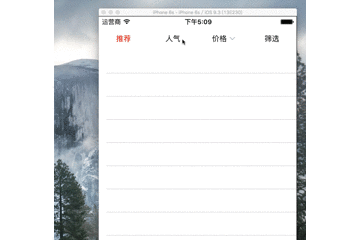

# LPFilterMenuView

一个简易的 筛选 工具条，适用于列表页顶部的筛选排序功能。



LPFilterMenuItem 筛选按钮基类

### 请使用以下类

* LPFilterMenuNormalItem

  最基本的，正常的按钮

* LPFilterMenuRepeatItem

  适于于有两种selected状态的按钮。

* LPFilterMenuSpecialItem

  特殊的按钮，一般适用于排序条上的筛选功能，可以和其他按钮共存。


### 使用方法

* 将LPFilterMenuView文件夹拖入项目中,`#import "LPFilter.h"`。
* 所有按钮的创建请使用工厂方法。

### LPFilterMenuView.h

可以在外界设置默认选中项  
`@property (nonatomic, assign) NSInteger firstClickIndex;`  
在外界创建按钮实例，并使用  
`@property (nonatomic, strong) NSArray <LPFilterMenuItem *> *lp_menuItems;`  
目前只能使用代理监听按钮的点击  
`@property (nonatomic, assign) id <LPFilterMenuViewDelegate> delegate;`

### LPFilterMenuNormalItem.h

`+ (instancetype)filterMenuNormalItemWithTitle:(NSString *)title;`

`+ (instancetype)filterMenuNormalItemWithTitle:(NSString *)title image:(UIImage *)image selectedImage:(UIImage *)selectedImage;`

### LPFilterMenuRepeatItem.h

```
LPFilterMenuRepeatItemTypeNormal, //正常状态
LPFilterMenuRepeatItemTypeSelected, //第一种选中状态
LPFilterMenuRepeatItemTypeRepeatSelected, //第二种选中状态
```

`//外界可以使用这个用来判断按钮的状态`
`@property (nonatomic, assign) LPFilterMenuRepeatItemType type;`

### LPFilterMenuSpecialItem.h

这个类很特殊，因为适用于筛选按钮，请在外界手动调整按钮的选中状态。

`//切换选中状态 - (void)selectedState;`

`//切换正常状态 - (void)normalState;`

注意 ： 这两个方法只针对特殊按钮有用。

### 作者寄语

* 这是本人第一个开源框架，还有很多不足，希望大家给予支持。
* 现在功能还有很多不足。想在后期加入更多的功能。
* 预计加入block监听

